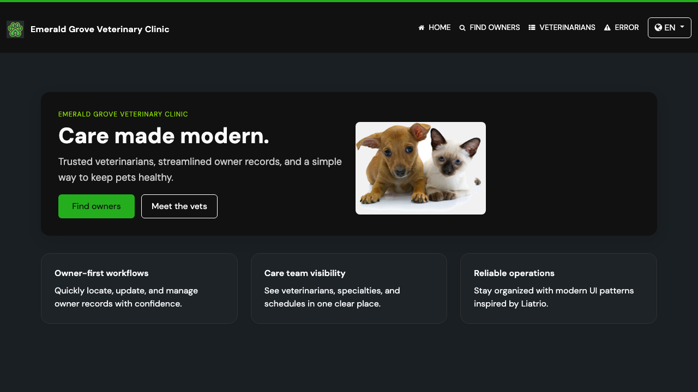
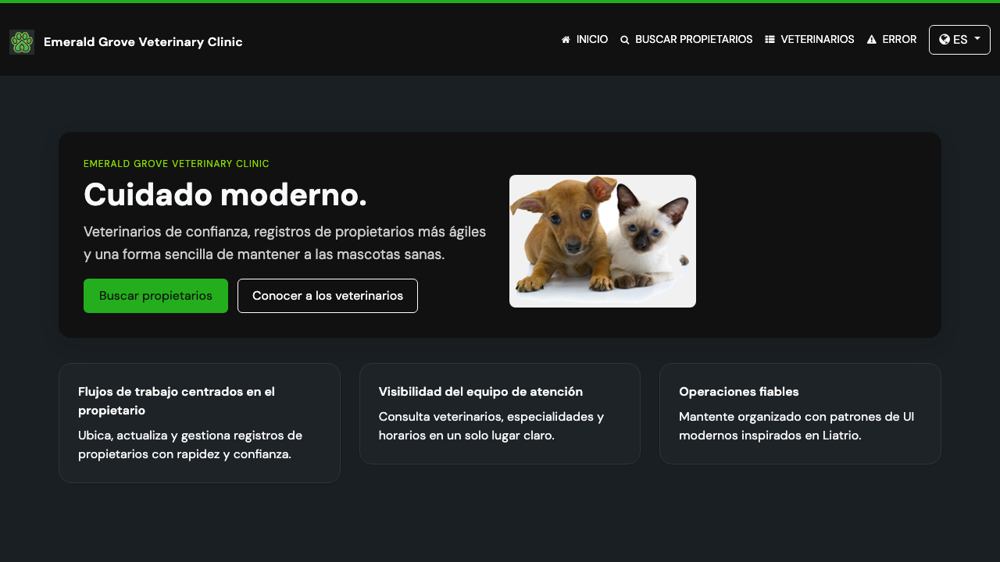
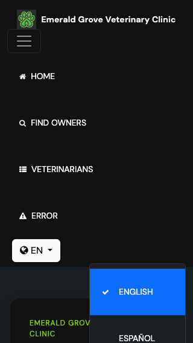

# Task 3.0 Proof Artifacts — Verification, Screenshots, and PR Readiness

## Screenshots

### Home Page in English (Default State)



**Demonstrates:** Language selector visible in navbar with globe icon and "EN" label. All page content in English.

### Home Page in Spanish



**Demonstrates:** Language selector shows "ES" after switching. All page content in Spanish ("Cuidado moderno.", "Buscar propietarios", "Veterinarios").

### Mobile View at 320px Width



**Demonstrates:** Language selector appears inside the hamburger menu on mobile. Dropdown opens correctly with no horizontal overflow. Checkmark visible on active language (English).

## Accessibility Audit

**Command:** `cd e2e-tests && npx playwright test --grep "accessibility"`

**Result:** PASS

```
Running 1 test using 1 worker
  1 passed (10.6s)
```

**Demonstrates:** axe-core WCAG 2.0 AA scan finds zero critical or serious violations on the home page including the new language selector.

## Keyboard Navigation

Bootstrap 5 dropdown provides native keyboard support:
- Tab focuses the language selector button
- Enter/Space opens the dropdown
- Arrow keys navigate between options
- Escape closes the dropdown
- This is verified implicitly by Bootstrap's standard dropdown behavior and the axe-core audit

## Final Test Suites

### Java Suite

**Command:** `./mvnw test`

**Result:** PASS

```
Tests run: 59, Failures: 0, Errors: 0, Skipped: 5
BUILD SUCCESS
```

### E2E Suite

**Command:** `cd e2e-tests && npx playwright test`

**Result:** PASS

```
  1 skipped
  23 passed
```

**Demonstrates:** No regressions across all existing test suites.
